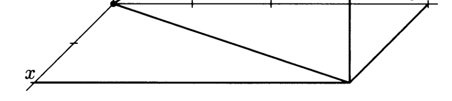

Parallelogram rule is used to add two vectors. 

# properties of parallelogram rule
1. commutative
    $\vec{r} + \vec{s} = \vec{s} + \vec{r}$
2. associative
    $(\vec{r} + \vec{s}) + \vec{t} = \vec{r} + (\vec{s} + \vec{t})$
3. distributive
    $(a+b)\vec{r} = a\vec{r} + b\vec{r}$
4. additive inverse 

1. <a href="zotero://open-pdf/library/items/MRG3JSBV?page=11&#x26;annotation=7JX927MA">“additive laws”</a> (<a href="zotero://select/library/items/AF5ZWLHB">Lax 和 Terrell, 2017, p. 2</a>)

‍
